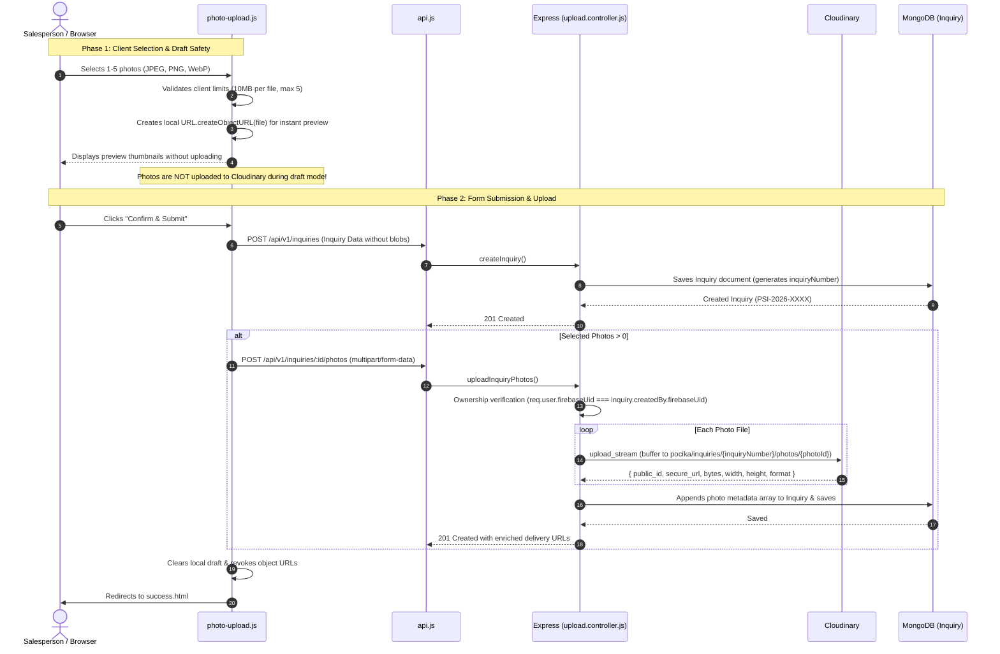

# Photo Upload & Lifecycle Flow

## 1. End-to-End Lifecycle

---

## 2. Safe Draft Handling
- When a salesperson inputs inquiry details across Steps 1–7, photos selected in Step 7 are held strictly in memory as raw `File` objects.
- `localStorage` drafts store only lightweight metadata: `[{ fileName, sizeKB }]`.
- Zero base64 strings or binary blobs are written to `localStorage` to avoid quota exceeded errors (`DOMException: QuotaExceededError`).
- Cloudinary is not called until the user explicitly commits the inquiry submission.

---

## 3. Compensating Cleanup Pattern
To prevent orphaned assets in Cloudinary if a network error or database error occurs during metadata saving:
- The controller tracks all newly uploaded `publicId`s in an in-memory array `uploadedAssets`.
- If `inquiry.save()` throws an exception, the `catch` block immediately invokes `deleteFromCloudinary(publicId)` for every newly uploaded asset before passing the error to Express error middleware.
